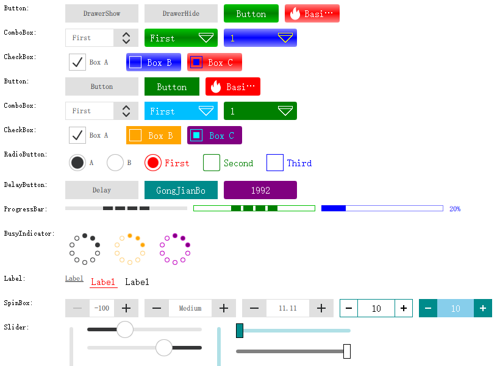
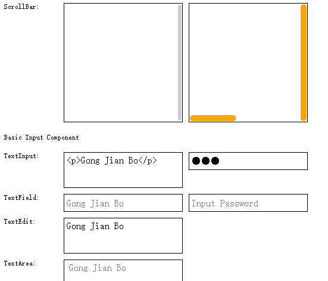

# QmlComponentStyle

- QML Component Style Demo Based on Qt5.12. QML组件样式Demo，以Qt5.12为基础版本。

- 正在更新到 Qt5.15，并进行完善...

# Environment （开发环境）

（2025-03-04）Win10/Win11 64bit + Qt5.15.2 + MSVC2019/MSVC2022 64bit

# Warning(注意)：

- It is mainly to learn QML component style customization and lack of encapsulation.（主要是学习QMl组件样式自定义，欠缺封装。）

- Mirror state is generally not considered in the code.（代码中一般没有考虑mirror（水平翻转）状态。）

# Demo Show(展示)：

